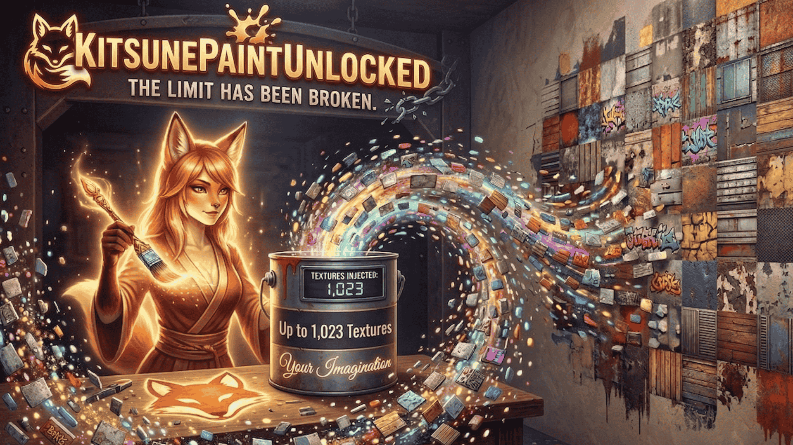

# KitsunePaintUnlocked



**Breaks the hardcoded 255 paint texture limit in 7 Days to Die, raising it to 1023.**

Vanilla 7D2D caps paint textures at 255 across five separate engine layers. KitsunePaintUnlocked patches all five simultaneously using Harmony, allowing large paint packs like PyroPaints, CK Textures, and KitsunePaints to run together without conflict.

**302 total paints confirmed working** on a dedicated server with KitsunePaints + PyroPaints + CK Textures running simultaneously — something the community previously accepted as impossible.

## Requirements

- 7 Days to Die V2.0+
- [OcbPaintUnlocked](https://github.com/Kitsune-Den/OcbPaintUnlocked) (KitsunePaintUnlocked-compatible fork of OcbCustomTextures, included in release)
- EAC **disabled** on server and all clients

## Installation

1. Extract the release zip into your `Mods/` folder on **both the server and all connecting clients**. This adds two folders: `0_PaintUnlocked` and `OcbCustomTextures`.
2. If you already have OcbCustomTextures installed, replace it with the version from this release. The PaintUnlocked fork is required -- vanilla OcbCustomTextures is not compatible.
3. Install your paint packs as usual (KitsunePaints, PyroPaints, CK Textures, etc.).
4. A **fresh world is required**. Existing worlds will display default textures on previously painted blocks.

Unpatched clients can still connect and use paint slots 0-254 normally.

## What it patches

PaintUnlocked modifies five engine layers to break the 255 limit:

### Layer 1: Network wire format

`NetPackageSetBlockTexture` sends paint indices as a single `byte` field. The packet is exactly 19 bytes with a hardcoded `GetLength()` -- adding bytes causes stream desync and instant disconnection.

PaintUnlocked uses a **field mutation prefix** on `write()`: for indices above 255, the `channel` byte is repurposed to carry overflow bits (bit 7 = overflow flag). Vanilla `write()` then serializes the modified fields through its normal `PooledBinaryWriter` path. For indices 0-254, the packet is byte-identical to vanilla.

On the receive side, `ProcessPackagePrefix` decodes the overflow from the channel field before vanilla `ProcessPackage` runs. This is reliable on both client and dedicated server, unlike `read()` prefixes which can be bypassed by JIT virtual dispatch.

### Layer 2: Chunk face storage (10-bit)

`Chunk.SetBlockFaceTexture`, `Chunk.GetBlockFaceTexture`, and `Chunk.Value64FullToIndex` use 8-bit masks and shifts to pack/unpack paint indices into an `Int64` per block. IL transpilers widen these to 10-bit (`0x3FF` mask, 10-bit shifts), supporting up to 1023 indices per face.

### Layer 3: Chunk storage width (64-bit)

`ChunkBlockChannel` stores `bytesPerVal` bytes per block position. Vanilla uses 6 bytes (48 bits) for textures -- only enough for 8 bits per face. PaintUnlocked patches the `ChunkBlockChannel` constructor to use 8 bytes (64 bits), providing room for 10 bits per face with 4 bits to spare.

### Layer 4: Paint ID allocation

The server loads fewer vanilla paints than the client (~155 vs ~407), causing custom paint IDs to diverge. The OcbCustomTextures fork seeds `GetFreePaintID` at ID 512 on both sides, ensuring identical allocation. It also dynamically resizes `BlockTextureData.list` when more paints are registered.

### Layer 5: Prefab texture re-encoding

Prefab placement uses `GetSetTextureFullArray` to write pre-packed Int64 texture values where faces are at 8-bit positions. PaintUnlocked re-encodes these to 10-bit positions before they enter the chunk, preventing custom textures from bleeding onto POI buildings.

### UI fixes

- **Toolbar thumbnails**: The game truncates paint IDs to a byte (`conv.u1`) before storing in `itemValue.Meta`, causing wrong thumbnails for custom paints. A transpiler removes the byte cast so the full paint ID is preserved.
- **Background texture protection**: A finalizer on `updateBackgroundTexture` catches exceptions for paint IDs beyond the atlas size, keeping the UI functional.

### Debug commands

Available in the F1 console:

- `pu_debug <paintID>` -- dumps BlockTextureData, TextureID, uvMapping, and GPU slot for a paint
- `pu_debug channels` -- shows ChunkBlockChannel array info for the chunk at the player's position
- `pu_debug toolbar` -- dumps the current paint tool's Meta value and BlockTextureData lookup

## Compatibility

- Works with any OcbCustomTextures-based paint pack
- Backward compatible: indices 0-254 are wire-identical to vanilla
- Unpatched clients can connect and use the vanilla paint range
- Compatible with custom POI packs (Fluffy Panda, etc.) -- prefab textures are re-encoded automatically
- **Requires the PaintUnlocked-compatible OcbCustomTextures fork** (included in release)

## Known limitations

- `TextureIdxToTextureFullValue64` (paint-all-faces from menu) is not yet patched with a specialized transpiler. Individual face painting works correctly.
- Fresh world required -- the 10-bit chunk storage format is not backward compatible with 8-bit worlds.
- `Graphics.CopyTexture` mip level warnings may appear for paint packs with mismatched texture mip counts. These are cosmetic and come from the paint packs, not PaintUnlocked.

## Building from source

Copy these from your 7D2D install's `7DaysToDie_Data/Managed/` into `7dtd-binaries/`:

- `Assembly-CSharp.dll`
- `Assembly-CSharp-firstpass.dll`
- `UnityEngine.dll`
- `UnityEngine.CoreModule.dll`
- `0Harmony.dll`
- `CustomTextures.dll` (from OcbCustomTextures fork)
- `LogLibrary.dll`

Then:

```
dotnet build PaintUnlocked.csproj -c Release
```

Output: `bin/Release/net48/PaintUnlocked.dll`

## Versioning

PaintUnlocked and the OcbCustomTextures fork ship as a **single release zip** to prevent version mismatches.

- **PaintUnlocked**: semver (e.g. `1.0.0`), drives the shared version
- **OcbCustomTextures fork**: `{upstream base}-pu{version}` (e.g. `0.8.0-pu1.0.0`)

Both version numbers are bumped together on every release.

## License

MIT -- see [LICENSE](LICENSE).

## Credits

- [ocbMaurice](https://github.com/OCB7D2D) for OcbCustomTextures, the foundation this builds on
- The 7D2D modding community for the paint packs that inspired this work
